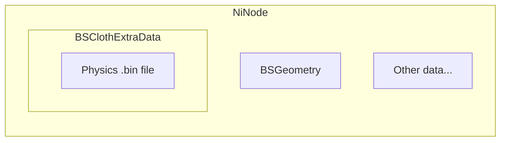

Cloth physics `.bin` file contains binary cloth physics data.

---

## FAQ

### Is it possible to create a custom cloth physics .bin file?
Yes, it is currently possible to create a custom cloth physics .bin file. You can refer to [Cloth Physics Guide](/user-manual/cloth-physics-guide/).

### Where are cloth physics .bin files?
In nifs containing physics data, cloth physics bin files are located next to the BSGeometry, in the BSClothExtraData.

### How to open cloth physics .bin file?
Currently, it is impossible to import the data from the physics .bin file to the editable physics graph. However, it is possible to visualize some of the data it contains (see [Cloth Physics Guide](/docs/user-manual/cloth-physics-guide/#inspecting-how-vanilla-does-it))